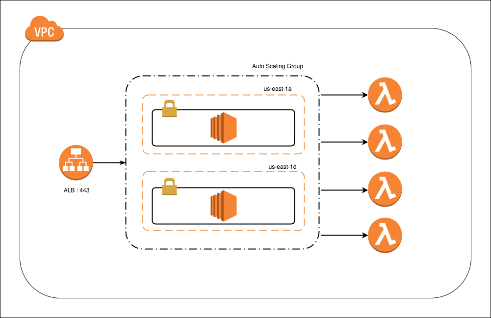

# HTTP/S Proxy Server for AWS Lambda Invocations

### Purpose

[Lambda Functions](https://aws.amazon.com/lambda/) are a FaaS implementation on Amazon Web Services. Setting them as HTTP/S endpoints over API Gateway can be complicated, and more often than not is an overkill for simple, internal APIs. 
Besides, API Gateway endpoints for Lambda are public, no matter how we slice and dice it. The recently announced VPC Link for API Gateway only allows the endpoints to route to a NLB target, not a Lambda. 

This is a lightweight HTTP/S proxy written in Java, which wraps a lambda invocation, mimicking the API Gateway-Lambda Proxy Integration.

The `/function` endpoint supports `GET`, `PUT`, `POST`, and `DELETE`. Any request sent to this endpoint is wrapped as [APIGatewayProxyRequestEvent](https://github.com/aws/aws-lambda-java-libs/blob/master/aws-lambda-java-events/src/main/java/com/amazonaws/services/lambda/runtime/events/APIGatewayProxyRequestEvent.java).

The Response from the Lambda is wrapped as [APIGatewayProxyResponseEvent](https://github.com/aws/aws-lambda-java-libs/blob/master/aws-lambda-java-events/src/main/java/com/amazonaws/services/lambda/runtime/events/APIGatewayProxyResponseEvent.java).

Here is the [documentation](http://docs.aws.amazon.com/lambda/latest/dg/eventsources.html) and samples of various events (this proxy only supports APIGatewayProxy events).

The request path, headers, HTTP method, querystring, body, etc. become a part of the event request that is sent to the Lambda _as-is_.

An alternative is to call Lambdas from within the code using AWS SDKs. However, having a proxy helps with centralizing monitoring (like NewRelic), security via IAM roles, and logging, making the infrastructure more manageable.  


### API

* `GET /healthcheck` - Used by the load balancer

* `GET /functions` - Get a list of lambda functions

* `GET | PUT | POST | DELETE  /function` - Invoke the Lambda Function named in the header `x-lambda-function-name`. This header can also contain the ARN of the function.


### Deployment

```bash
$ git clone git@github.com:lobster1234/lambda-proxy.git
$ cd lambda-proxy
$ mvn clean install jetty:run
```

This will run the lambda proxy server on jetty, port 8080. 

To deploy in Tomcat, copy `target/lambda-proxy-1.0-SNAPSHOT.war` and copy it to `$TOMCAT_HOME/webapps` as lambda-proxy.war.


### IAM Policy

If this proxy will run in an autoscaling group in AWS (recommended), create a role with the below inline policy for the instances - 

```json
{
    "Version": "2012-10-17",
    "Statement": [
        {
            "Sid": "InvokePermission",
            "Effect": "Allow",
            "Action": [
                "lambda:InvokeFunction",
                "lambda:ListFunctions"
            ],
            "Resource": "*"
        }
    ]
}  
```

If on-prem or on a laptop, attach the above policy to the IAM user whose credentials will sit in `~/.aws/credentials`.

### Usage

* Healtcheck for LBs

```bash

$ curl -i http://localhost:8080/healthcheck
HTTP/1.1 200 OK
Date: Tue, 12 Dec 2017 02:17:31 GMT
Content-Type: text/html; charset=UTF-8
Transfer-Encoding: chunked
Server: Apache Tomcat/8.5.11

OK
```

* Get a list of lambda functions

```bash
$ curl -i http://localhost:8080/functions
HTTP/1.1 200 OK
Date: Tue, 12 Dec 2017 02:19:07 GMT
Content-Type: application/json
Transfer-Encoding: chunked
Server: Apache Tomcat/8.5.11

[
  {
    "functionName": "internal-api-function",
    "functionArn": "arn:aws:lambda:us-east-1:************:function:internal-api-function",
    "runtime": "python3.6",
    "role": "arn:aws:iam::************:role/lambda_basic_execution",
    "handler": "lambda_function.lambda_handler",
    "codeSize": 224,
    "description": "",
    "timeout": 3,
    "memorySize": 128,
    "lastModified": "2017-12-11T21:29:15.067+0000",
    "codeSha256": "LatqSbOH1YVr/D1eQBdPdTxeBP9RN2HvcsQ4zq5kSBA=",
    "version": "$LATEST"
  },
  { ..... },

 
 ]
```
* Invoke a lambda function

```bash
$ curl -i -X POST http://localhost:8080/lambda-proxy/function -H 'x-lambda-function-name:internal-api-function'
  HTTP/1.1 200
  Content-Type: application/json
  Transfer-Encoding: chunked
  Date: Fri, 08 Dec 2017 09:22:43 GMT
  Server: Apache Tomcat/8.5.11
  
  {
     "statusCode":200,
     "headers":{
        "Connection":"keep-alive",
        "Content-Length":"32",
        "Content-Type":"application/json",
        "Date":"Tue, 12 Dec 2017 02:37:26 GMT",
        "X-Amz-Executed-Version":"$LATEST",
        "x-amzn-Remapped-Content-Length":"0",
        "x-amzn-RequestId":"63fb9b2a-dee5-11e7-b8f2-d9f80d0f5343",
        "X-Amzn-Trace-Id":"root\u003d1-5a2f40e6-52ae1b8237280e7433c44129;sampled\u003d0"
     },
     "body":"{\"message\": \"Hello from Lambda\"}"
  }
```


### Typical Deployment in AWS



### Errors


* Missing function name

```bash
$ curl -i  http://localhost:8080/lambda-proxy/function                                          
HTTP/1.1 400
Content-Type: application/json
Transfer-Encoding: chunked
Date: Sat, 09 Dec 2017 03:53:12 GMT
Connection: close
Server: Apache Tomcat/8.5.11

{
   "statusCode":400,
   "body":"{\"Error\":\"Must provide x-lambda-function-name header\"}}"
}```

* Function Not Found
```bash
$ curl -i -X POST http://localhost:8080/lambda-proxy/function -H 'x-lambda-function-name:getBankTransactions-dev-get-transactions'
HTTP/1.1 404
Content-Type: application/json
Transfer-Encoding: chunked
Date: Fri, 08 Dec 2017 10:00:01 GMT
Server: Apache Tomcat/8.5.11

{
   "statusCode":404,
   "body":"Function not found: arn:aws:lambda:us-east-1:************:function:internal-api-func
   (Service: AWSLambda; Status Code: 404; Error Code: ResourceNotFoundException; 
   Request ID: 324e3566-dee6-11e7-a4b9-4b1d43c1a0fb)"
}
```

* Runtime Failure

```bash
$ curl -i -X POST http://localhost:8080/lambda-proxy/function -H 'x-lambda-function-name:getBankTransactions-dev-get-accounts'
HTTP/1.1 500
Content-Type: application/json
Transfer-Encoding: chunked
Date: Fri, 08 Dec 2017 09:56:01 GMT
Connection: close
Server: Apache Tomcat/8.5.11

{
   "statusCode":500,
   "headers":{
      "Connection":"keep-alive",
      "Content-Length":"977",
      "Content-Type":"application/json",
      "Date":"Tue, 12 Dec 2017 02:45:17 GMT",
      "X-Amz-Executed-Version":"$LATEST",
      "X-Amz-Function-Error":"Unhandled",
      "x-amzn-Remapped-Content-Length":"0",
      "x-amzn-RequestId":"7a631eae-dee6-11e7-8086-336ec7993e7e",
      "X-Amzn-Trace-Id":"root\u003d1-5a2f42b9-345e852014cba0137b8dc18a;sampled\u003d0"
   },
   "body":"{\"errorMessage\":\"java.lang.ExceptionInInitializerError\",\"errorType\":
   \"java.lang.ExceptionInInitializerError\",\"stackTrace\":[\"com.serverless.foo.AccountsHandler.handleRequest
   (AccountsHandler.java:34)\"],\"cause\":{\"errorMessage\":\"com.serverless.foo.ApplicationException: 
   Bad Request\",\"errorType\":\"java.lang.RuntimeException\",\"stackTrace\":\"]}}}"
}```